<p align="center">
  
</p>

```
RUDRA(1)                         User Commands                        RUDRA(1)
```

## NAME

**rudra** — generalist; games, mobile apps, data pipelines; CS at Illinois Tech, Chicago

## SYNOPSIS

**rudra** \[**--whatever-the-stack-is**] \[**--ship-the-prototype**] \[*problem* ...]

## DESCRIPTION

I have not specialised, and that's deliberate. Games, mobile apps, data
pipelines, web frontends, native Android. Thirty-three repos across most of it.

The most recent stretch has been health software for phones. **CalorieSnap**
estimates the calories in a meal from a photo, Flutter client over a Flask and
ML backend. **GuardianCare** is a medication and vitals tracker built for
elderly users who find most health apps unusable.

What carries between all of them is being willing to learn the stack the
problem actually wants instead of bending the problem toward the stack I
already know.

Currently looking for internships and new grad roles.

## OPTIONS

```
--pick-the-stack        Chooses the tool for the problem, not the resume.
--flutter               Current default. Two shipped apps, iOS and Android.
--flask                 Spins up a backend when the model won't fit on-device.
--accessibility         Enabled by default since GuardianCare. Large targets,
                        real contrast ratios, screen-reader labels.
--ship-the-prototype    Will hand you an APK before it's pretty. See BUGS.
```

## ENVIRONMENT

<p>
  
  
  
  
  
  
</p>

## FILES

| Path | Description |
| :--- | :--- |
| [`~/CalorieSnap`](https://github.com/Rudra2198/CalorieSnap) | Point a camera at a plate, get a calorie estimate. Flutter client, Flask + ML backend. Installable APK in the repo. |
| [`~/GuardianCare`](https://github.com/Rudra2198/GuardianCare) | Health management for elderly users. Medication reminders, vitals charting, one-tap emergency call. Built accessibility-first. |
| [`~/Quizzo`](https://github.com/Rudra2198/Quizzo) | Native Kotlin flag-guessing quiz. The one that taught me Android properly. |
| [`~/Expenso`](https://github.com/Rudra2198/Expenso) | React expense tracker. Small, but it's where the state management finally clicked. |
| [`~/YOUR_GAME_REPO`](https://github.com/Rudra2198/YOUR_GAME_REPO) | **FILL THIS IN.** The banner claims games. Pick your best one. |
| [`~/YOUR_PIPELINE_REPO`](https://github.com/Rudra2198/YOUR_PIPELINE_REPO) | **FILL THIS IN.** Same for data pipelines. |

## EXAMPLES

Estimate lunch:

```console
$ rudra --flutter --flask < plate.jpg
[  0.00] loading model
[  1.42] detected: rice, dal, two rotis
[  1.42] ~640 kcal (±90, it is a prototype)
```

Ask about work:

```console
$ rudra --hire
> open to most things. contact is in SEE ALSO.
```

## EXIT STATUS

<p align="center">
  
  
</p>

## BUGS

Ships the APK before the UI is finished, then writes "subject to future
improvements" in the README and calls it documentation. Has a YOLO achievement,
which is a badge GitHub gives you for merging your own pull request without a
review, and is not something to be proud of.

## SEE ALSO

[email](mailto:YOUR_EMAIL) &nbsp;|&nbsp; [linkedin](https://linkedin.com/in/YOUR_HANDLE) &nbsp;|&nbsp; [resume](YOUR_RESUME_LINK)

```
rudra                             2026-09-02                          RUDRA(1)
```
